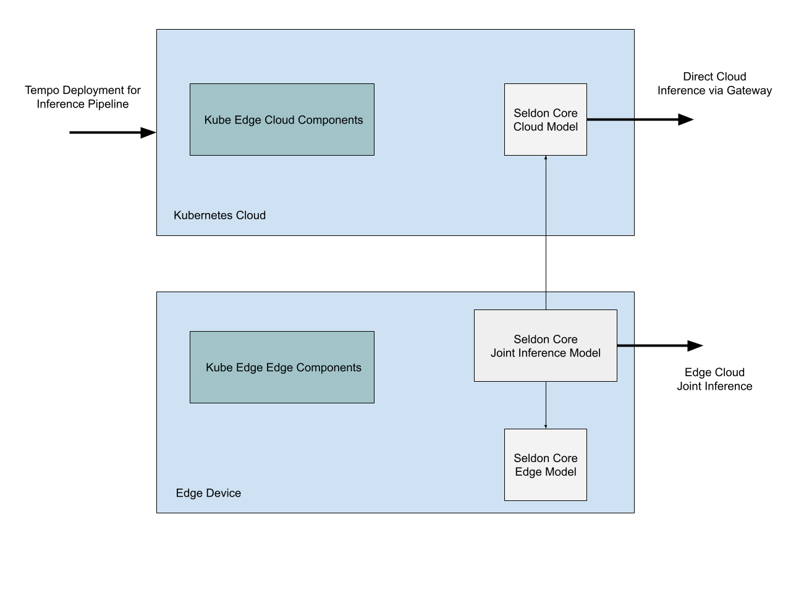

# Edge Cloud Joint Inference with Seldon Core and Tempo

This repo is an experiment to run a joint inference with ML models running on the cloud and edge devices using the following projects

- [Kubeedge](https://kubeedge.io/en/) on Kubernetes
- [Seldon Core](https://github.com/SeldonIO/seldon-core)
- [Tempo](https://github.com/SeldonIO/tempo)

## Introduction

The cloud edge joint inference is basically a custom inference pipeline as per the Tempo definition. There is an existing project in Kubeedge ecosystem for this solution called [Sedna](https://github.com/kubeedge/sedna) which has a joint inference CRD that aims at solving this exact challenge.

> Sedna is an edge-cloud synergy AI project incubated in KubeEdge SIG AI. Benefiting from the edge-cloud synergy capabilities provided by KubeEdge, Sedna can implement across edge-cloud collaborative training and collaborative inference capabilities, such as joint inference, incremental learning, federated learning, and lifelong learning. Sedna supports popular AI frameworks, such as TensorFlow, Pytorch, PaddlePaddle, MindSpore.

The Joint Inference CRD is a powerful abstraction of this very specific solution where a hard example mining logic decides if the inference happens on the edge or the cloud.

Tempo project from Seldon has the capability to extend this to any given custom inference pipeline and this repo is an experiment to verify this hypothesis.

### Kubeedge Sedna Joint Inference Service

Checkout this [example](https://github.com/kubeedge/sedna/tree/main/examples/joint_inference/helmet_detection_inference) using Joint Inference Service in Helmet Detection Scenario

> This case introduces how to use joint inference service in helmet detection scenario. In the safety helmet detection scenario, the helmet detection shows lower performance due to limited resources in edge. However, the joint inference service can improve overall performance, which uploads hard examples that identified by the hard example mining algorithm to the cloud and infers them. The data used in the experiment is a video of workers wearing safety helmets. The joint inference service requires to detect the wearing of safety helmets in the video.

### Tempo based Joint Inference Pipeline

Checkout the experiment [notebook](./README.ipynb) and the [setup](./setup/setup.md) for details.

### References

- https://github.com/adriangonz/kubeedge-talk
- https://github.com/kubeedge/sedna
- https://github.com/SeldonIO/tempo
- https://github.com/SeldonIO/seldon-core
